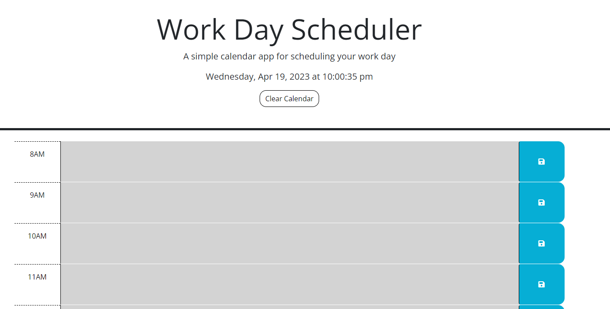

# cal-app

## Description

This calendar app is a user-friendly tool designed to make scheduling and event planning a breeze. After refactoring and improving the code, the app now has the ability to save calendar events and persist them upon a browser reload, ensuring that users don't lose their valuable scheduling information. 

Working on this project has given me experience in making improvements to already-existing code, which is an excellent way for new developers to learn and grow while contributing to the development of valuable projects. It provides opportunities for practical learning, skill development, and portfolio building that can help new developers stand out in a competitive job market.

## Installation

No installation required, but if you want to run this locally:

### Requirements

- [Visual Studio Code](https://code.visualstudio.com/download)

- [Live Server Extension](https://marketplace.visualstudio.com/items?itemName=ritwickdey.LiveServer)

## Usage

1. You will require an IDE such as Visual Studio Code. 

2. After installing Visual Studio Code, install the Live Server extension.

3. Download the project code and export it to your local machine.

4. Open the folder where index.html resides in Visual Studio Code.

5. Right-click index.html and choose "Open with Live Server".

6. Enter information into a time slot and click the save icon. Data will persist on reloading the browser.

## Preview

[Link to site](https://justjenb.github.io/cal-app/)

## Credits

### References

https://blog.terresquall.com/2022/09/fixing-the-e-indexof-is-not-a-function-error-on-your-website/

https://stackoverflow.com/questions/4584373/difference-between-window-load-and-document-ready-functions

https://stackoverflow.com/questions/4931825/regular-expression-any-number

https://stackoverflow.com/questions/75718279/im-trying-to-compare-time-using-dayjs-as-well-as-jquery

https://stackoverflow.com/questions/72512032/how-can-i-compare-the-current-time-with-my-divs-id-900-in-javascript

https://www.geeksforgeeks.org/jquery-click-method/

https://www.geeksforgeeks.org/how-to-select-id-that-starts-with-certain-character-using-jquery/#

https://www.geeksforgeeks.org/how-to-send-row-data-when-clicking-button-using-javascript/

https://stackoverflow.com/questions/42963091/how-to-save-the-value-of-textarea-to-localstorage-then-display-it-in-the-same-te

https://www.geeksforgeeks.org/how-to-get-the-value-of-a-textarea-in-jquery/#

https://www.tutorialrepublic.com/faq/how-to-get-the-value-of-a-textarea-in-jquery.php

https://api.jquery.com/find/

https://herewecode.io/blog/replace-item-array-javascript/

## License

Please refer to the LICENSE in the repo.
